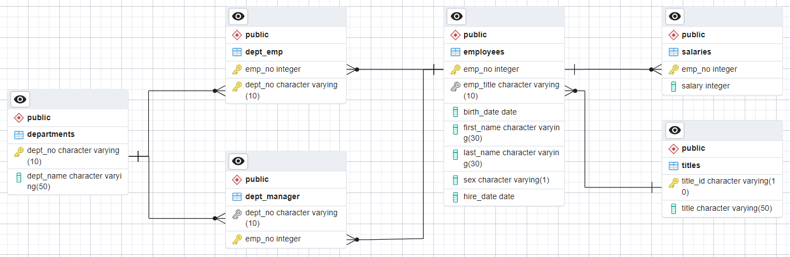

# Organize Employee Data for Analysis
This project creates a SQL database based on employe data available in csv files. After the SQL database is created, some relationship analysis is completed

# Features
* Create table schema (ERD and .sql file) for each of teh six csv files
* Create a database with tables using the defined schema and import the csv files
* Complete the following analysis using SQL queries and save the queries into a single file
   1. List the employee number, last name, first name, sex, and salary of each employee.
   2. List the first name, last name, and hire date for the employees who were hired in 1986.
   3. List the manager of each department along with their department number, department name, employee number, last name, and first name.
   4. List the department number for each employee along with that employee’s employee number, last name, first name, and department name.
   5. List first name, last name, and sex of each employee whose first name is Hercules and whose last name begins with the letter B.
   6. List each employee in the Sales department, including their employee number, last name, and first name.
   7. List each employee in the Sales and Development departments, including their employee number, last name, first name, and department name.
   8. List the frequency counts, in descending order, of all the employee last names (that is, how many employees share each last name).

# Results

SQL Database ERD:  

# File Notes
* EmployeeSQL folder contains all the files required to complete the challenge as indicated by the Challenge Instructions below.
   * data folder contains all the csv files downloaded from BCS/Canvas that were imported into the SQL tables
      **Note** Some employees.first_names were "TRUE" and treated as a real name per manager direction.
   * resources folder contains all the schema files created in the QuickDBD tool linked in the references:
      * **Schema_QuickDBD.sql** is the file used to create each table within PostgreSQL (Create a .sql file of your table schemata.)
      * SchemaDiagram_QuickDBD.png is a picture of the ERD created in Quick DBD for the tables created in this challenge (Create an image file of your ERD.)
      * Schema_QuickDBD.pdf is the pdf of the text input to the QuickDBD tool to create the ERD
   * **ChallengeSolutions.sql** contains queries to view the tables after importing the csv files as well as the data analysis requested within the Challenge Instructions (Create a .sql file of your queries.)
   * ERD_PostgreSQL_pgAdmin4.pgerd is the ERD export from PostgreSQL pgAdmin4 after creating the tables using Schema_QuickDBD.sql
   * ERD_PostgreSQL_pgAdmin4.png is a snapshot of the ERD view from PostgreSQL pgAdmin4 after creating the tables using Schema_QuickDBD.sql
* Starter_Code folder contains the files provided in BCS/Canvas for completing the challenge.
   

# References
Data
   * Data generated by Mockaroo, LLC(https://mockaroo.com/), (2022). Realistic Data Generator.
The following references were used in creating the solution within the EmployeeSQL folder:
 * http://www.quickdatabasediagrams.com/ was used to create the initial ERD as well as SQL file to be used in PostgreSQL to create the tables used in this challenge.

# Getting Started

## Prerequisites
You must have PostgreSQL and pgAdmin4 installed 

## Cloning Repo
$ git clone https://github.com/vt-bekah/sql-challenge.git

$ cd sql-challenge

# Built With
* PostgreSQL version 14.9 for Windows x86-64 https://www.enterprisedb.com/downloads/postgres-postgresql-downloads 
* pgAdmin 4 version 7.5  https://www.postgresql.org/ftp/pgadmin/pgadmin4/v7.5/windows/ 